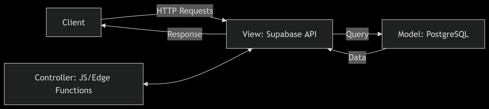

# SDD Section 1: Introduction

## Sequence/Workflow

### Database
Here is a CRUD example for employee.
- Create
    ``` 
        const { data, error } = await supabase
            .from('employees')
            .insert([
            { 
                employee_id: supabase.auth.user().id,
                first: 'Jane',
                last: 'Doe',
                position: 'Lifeguard',
                location: 'Hart',
                group: 'Lifeguards',
                email: 'jane@company.com'
                }
        ]);
    ```
- Read
    ```
        const { data, error } = await supabase
            .from('employees')
            .select('*');
    ```
- Update
    ```
        const { data, error } = await supabase
            .from('employees')
            .update({ email: janedoe@company.com })
            .eq('id', 'a1b2c3d4-5678-90ef-ghij-klmnopqrstuv');
    ```
- Delete
    ```
        const { data, error } = await supabase
            .from('employees')
            .delete()
            .eq('id', 'a1b2c3d4-5678-90ef-ghij-klmnopqrstuv');
    ```
## Architecture

### Database
The Rec Services database tier is built on Supabase, an open-source Firebase alternative with a PostgreSQL backend. It provides:

- Real-time capabilities via WebSockets.
- Automatic REST APIs (PostgREST).
- Authentication & Row-Level Security (RLS).
- Scalable PostgreSQL hosting with extensions (e.g., pg_crypto, uuid-ossp).

- Employee table
    ```
        CREATE TABLE IF NOT EXISTS `recservices`.`employees` (
            `employee_id` INT NOT NULL,
            `first` VARCHAR(45) NOT NULL,
            `last` VARCHAR(45) NOT NULL,
            `position` VARCHAR(45) NULL,
            `location` VARCHAR(45) NULL,
            `group` VARCHAR(45) NULL,
            `email` VARCHAR(45) NULL,
            `wage` INT NULL,
            `Salary` TINYINT(1) NULL,
            PRIMARY KEY (`employee_id`))
    ENGINE = InnoDB;
    ```
- Shift table
    ```
        CREATE TABLE IF NOT EXISTS `recservices`.`shift` (
            `idShift` INT NOT NULL,
            `start` DATETIME NULL,
            `end` DATETIME NULL,
            `employees_employee_id` INT NOT NULL,
            `upfortrade` TINYINT NOT NULL,
        PRIMARY KEY (`idShift`),
        INDEX `fk_Shift_Employees_idx` (`employees_employee_id` ASC) VISIBLE,
        CONSTRAINT `fk_Shift_Employees`
        FOREIGN KEY (`employees_employee_id`)
        REFERENCES `recservices`.`employees` (`employee_id`)
        ON DELETE NO ACTION
        ON UPDATE NO ACTION)
        ENGINE = InnoDB;
    ```
- Department 
    ```
            CREATE TABLE IF NOT EXISTS `recservices`.`department` (
                `id` INT NOT NULL,
                `address*(split_into_parts)` VARCHAR(45) NULL,
                `number_of_employees` INT NULL,
                `name` VARCHAR(45) NULL,
                `employees_employee_id` INT NOT NULL,
            PRIMARY KEY (`id`),
            INDEX `fk_Department_Employees1_idx` (`employees_employee_id` ASC) VISIBLE,
            CONSTRAINT `fk_Department_Employees1`
                FOREIGN KEY (`employees_employee_id`)
                REFERENCES `recservices`.`employees` (`employee_id`)
                ON DELETE NO ACTION
                ON UPDATE NO ACTION)
            ENGINE = InnoDB;
    ```
- Position
    ```
        CREATE TABLE IF NOT EXISTS `recservices`.` position` (
            `id_position` INT NOT NULL,
            `nameofposition` VARCHAR(45) NULL,
            `number of people` INT NULL,
            `employees_employee_id` INT NOT NULL,
        PRIMARY KEY (`id_position`),
        INDEX `fk_ position_Employees1_idx` (`employees_employee_id` ASC) VISIBLE,
        CONSTRAINT `fk_ position_Employees1`
            FOREIGN KEY (`employees_employee_id`)
            REFERENCES `recservices`.`employees` (`employee_id`)
            ON DELETE NO ACTION
            ON UPDATE NO ACTION)
        ENGINE = InnoDB;
    ```
## Component ID

