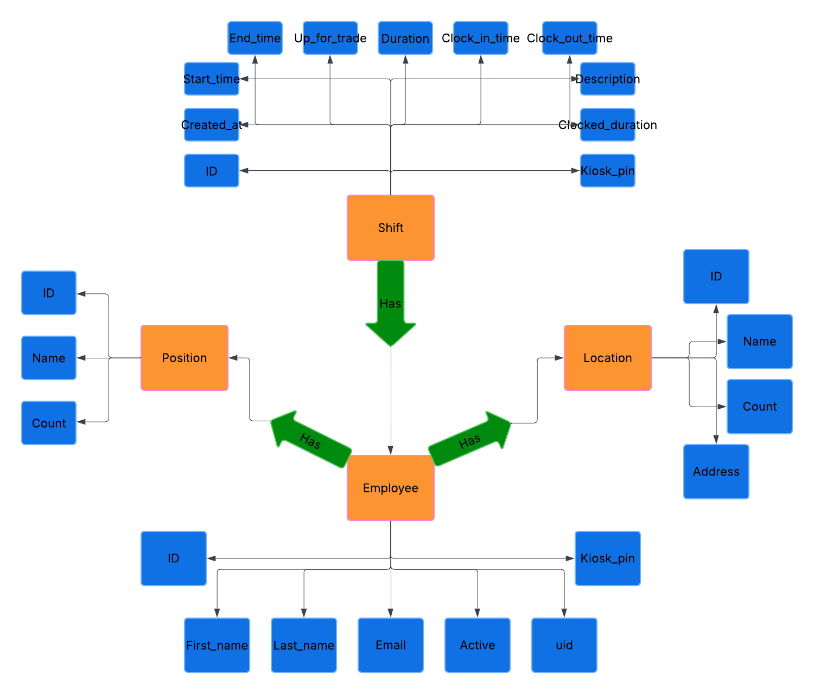

# SDD Section 6: Database: Entity Relationship diagrams
An Entity Relationship diagram is a map of how entities—typically classes and attributes—are organized and defined in a system. Below is an ER diagram showing the relationships and attributes of Employees, Locations, Shifts, and Positions.

